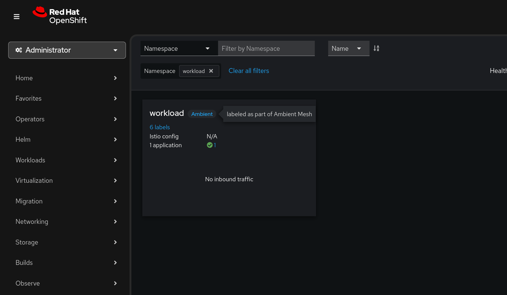

#+TITLE: OpenShift Ambient Mesh Setup
#+DATE: <2025-08-21 Thu>
#+AUTHOR: James Blair

This is a short demonstration of [[https://istio.io/latest/docs/ambient][Istio Ambient Mesh]] on OpenShift ~4.19~ via the [[https://docs.redhat.com/en/documentation/openshift_container_platform/4.19/html-single/service_mesh/index][OpenShift Service Mesh]] operator.

You can install Istio ambient mode on OpenShift Container Platform 4.19 or later and Red Hat OpenShift Service Mesh 3.1.0 or later with the required Gateway API custom resource definitions (CRDs).

This is currently a Technology Preview feature of OpenShift.

* Pre-requisites

Before we begin, let's ensure we are logged into our cluster in the terminal and the cluster meets our version requirements.

** Verify cluster auth status

#+NAMEL: Verify cluster login status
#+begin_src bash
oc version && oc whoami
#+end_src

#+RESULTS:
#+begin_example
Client Version: 4.19.7
Kustomize Version: v5.5.0
Server Version: 4.19.9
Kubernetes Version: v1.32.7
admin
#+end_example

** Upgrade cluster

The Red Hat demo system environment available was not yet running OpenShift 4.19 so I needed to upgrade it before performing any demo preparation steps.

The first step is to acknowledge the k8s [[https://access.redhat.com/articles/7112216][api deprecations]] between 4.18 and 4.19.

#+NAME: Patch admin acks
#+begin_src tmux
oc -n openshift-config patch cm admin-acks --patch '{"data":{"ack-4.18-kube-1.32-api-removals-in-4.19":"true"}}' --type=merge
#+end_src

Once admin acks are in place we can set the upgrade channel to ~fast-.419~.

#+NAME: Set cluster upgrade channel to 4.19
#+begin_src tmux
oc adm upgrade channel fast-4.19
#+end_src

Now we're ready to trigger the upgrade.

#+NAME: Trigger the cluster upgrade
#+begin_src tmux
oc adm upgrade --to 4.19.9
#+end_src

Before proceeding with any further steps let's wait for the cluster upgrade to complete.

#+NAME: Wait for the upgrade to complete
#+begin_src tmux
oc adm wait-for-stable-cluster
#+end_src

* Install service mesh operator

Our first step to prepare the demonstration is to install the service mesh operator.

#+NAME: Create operator subscription
#+begin_src bash
cat << EOF | oc apply --filename -
apiVersion: operators.coreos.com/v1alpha1
kind: Subscription
metadata:
  name: servicemeshoperator3
  namespace: openshift-operators
spec:
  channel: stable
  installPlanApproval: Automatic
  name: servicemeshoperator3
  source: redhat-operators
  sourceNamespace: openshift-marketplace
EOF
#+end_src

#+RESULTS: Create operator subscription
#+begin_example
subscription.operators.coreos.com/servicemeshoperator3 created
#+end_example

Once the operator has completed installation we should see new Custom Resources available for use:

#+NAME: Check sail operator crds
#+begin_src bash
oc get crd | grep sail
#+end_src

#+RESULTS: Check sail operator crds
| istiocnis.sailoperator.io         | 2025-08-21T00:30:28Z |
| istiorevisions.sailoperator.io    | 2025-08-21T00:30:28Z |
| istiorevisiontags.sailoperator.io | 2025-08-21T00:30:29Z |
| istios.sailoperator.io            | 2025-08-21T00:30:28Z |
| ztunnels.sailoperator.io          | 2025-08-21T00:30:28Z |

* Deploy ambient istio

** Deploy istio control plane

With the operator installed lets install the istio control plane with the ~ambient~ profile.

#+NAME Install istio control plane
#+begin_src bash
cat << EOF | oc apply --filename -
apiVersion: v1
kind: Namespace
metadata:
  name: istio-system

---
apiVersion: sailoperator.io/v1
kind: Istio
metadata:
  name: default
spec:
  namespace: istio-system
  profile: ambient
  values:
    pilot:
      trustedZtunnelNamespace: ztunnel
    meshConfig:
      discoverySelectors:
      - matchLabels:
          istio-discovery: enabled
EOF
#+end_src

#+RESULTS:
#+begin_example
namespace/istio-system created
istio.sailoperator.io/default created
#+end_example

Once the custom resources are created we can wait for the istio control plane deployment to become ready.

#+NAME: Wait for istio control plane deployment
#+begin_src bash
oc wait --for=condition=Ready istios/default --timeout=3m
#+end_src

#+RESULTS: Wait for istio control plane deployment
#+begin_example
istio.sailoperator.io/default condition met
#+end_example

** Deploy istio container network interface

Once the control plane is in place we'll create the corresponding networking components, again with the profile ~ambient~.

#+NAME: Deploy istio cni
#+begin_src bash
cat << EOF | oc apply --filename -
apiVersion: v1
kind: Namespace
metadata:
  name: istio-cni

---
apiVersion: sailoperator.io/v1
kind: IstioCNI
metadata:
  name: default
spec:
  namespace: istio-cni
  profile: ambient
EOF
#+end_src

#+RESULTS: Deploy istio cni
#+begin_example
namespace/istio-cni created
istiocni.sailoperator.io/default created
#+end_example

As we did earlier, after creating the custom resources we can wait for the components to become ready.

#+NAME: Wait for istio cni deployment
#+begin_src bash
oc wait --for=condition=Ready istios/default --timeout=3m
#+end_src

#+RESULTS: Wait for istio cni deployment
#+begin_example
istio.sailoperator.io/default condition met
#+end_example

** Deploy istio ztunnel proxies

Lastly, we need to deploy the istio ztunnel proxies which are a per-node proxy that manages secure, transparent tcp connections for all workloads on the node. Once again these will be deployed with the ~ambient~ profile.

#+NAME: Deploy istio ztunnel proxies
#+begin_src bash
cat << EOF | oc apply --filename -
apiVersion: v1
kind: Namespace
metadata:
  name: ztunnel

---
apiVersion: sailoperator.io/v1alpha1
kind: ZTunnel
metadata:
  name: default
spec:
  namespace: istio-system
  profile: ambient
EOF
#+end_src

#+RESULTS: Deploy istio ztunnel proxies
#+begin_example
namespace/ztunnel created
ztunnel.sailoperator.io/default created
#+end_example

And again let's wait to verify that these have deployed successfully before proceeding.

#+NAME: Wait for istio ztunnel deployment
#+begin_src bash
oc wait --for=condition=Ready ztunnel/default --timeout=3m
#+end_src

#+RESULTS: Wait for istio ztunnel deployment
#+begin_example
ztunnel.sailoperator.io/default condition met
#+end_example

* Deploying a sample workload

Once our istio ambient mode mesh is in place, let's deploy a workload. Notice how we include the ~istio.io/dataplane-mode: ambient~ label on our namespace to enrol all workloads in the mesh in our namespace.

#+NAME: Deploy sample workload
#+begin_src bash
cat << EOF | oc apply --filename -
apiVersion: v1
kind: Namespace
metadata:
  name: workload
  labels:
    istio.io/dataplane-mode: ambient
EOF

oc apply --namespace workload --filename workload.yaml
#+end_src

#+RESULTS: Deploy sample workload
#+begin_example
namespace/workload created
deployment.apps/quake created
service/quake created
configmap/quake3-server-config created
#+end_example

* Observing the mesh

With istio deployed in ambient mode and a workload enabled, let's validate this by installing [[https://kiali.io][Kiali]] to enable mesh observability.

** Installing the kiali operator

To install the operator all we need to do is create a ~Subscription~ resource.

#+NAME: Installing the kiali operator
#+begin_src bash
cat << EOF | oc apply --filename -
apiVersion: operators.coreos.com/v1alpha1
kind: Subscription
metadata:
  name: kiali-ossm
  namespace: openshift-operators
spec:
  channel: stable
  installPlanApproval: Automatic
  name: kiali-ossm
  source: redhat-operators
  sourceNamespace: openshift-marketplace
EOF
#+end_src

#+RESULTS: Installing the kiali operator
#+begin_example
subscription.operators.coreos.com/kiali-ossm created
#+end_example

** Enable cluster user workload monitoring

While the operator is installing let's enable user workload monitoring on our cluster, we'll need this to scrape metrics from our deployed service mesh control plane and ztunnel proxies.

#+NAME: Enable cluster user workload monitoring
#+begin_src bash
cat << EOF | oc apply --filename -
apiVersion: v1
kind: ConfigMap
metadata:
  name: cluster-monitoring-config
  namespace: openshift-monitoring
data:
  config.yaml: |
    enableUserWorkload: true
EOF
#+end_src

#+RESULTS: Enable cluster user workload monitoring
#+begin_example
configmap/cluster-monitoring-config created
#+end_example

** Configure openshift monitoring with service mesh

Let's also ensure that cluster monitoring knows to scrape mesh metrics by creating a ~ServiceMonitor~.

#+NAME: Create service monitor for istio control plane
#+begin_src bash
cat << EOF | oc apply --filename -
apiVersion: monitoring.coreos.com/v1
kind: ServiceMonitor
metadata:
  name: istiod-monitor
  namespace: istio-system
spec:
  targetLabels:
  - app
  selector:
    matchLabels:
      istio: pilot
  endpoints:
  - port: http-monitoring
    interval: 30s
EOF
#+end_src

#+RESULTS: Create service monitor for istio control plane
#+begin_example
servicemonitor.monitoring.coreos.com/istiod-monitor created
#+end_example

** Assign kiali permissions

With the mesh metrics being scraped by the cluster prometheus instance we are almost ready to deploy Kiali to visualize them. Before we do, let's ensure kiali will have permissions to retrieve cluster monitoring information.

#+NAME: Assign kiali permissions
#+begin_src bash
cat << EOF | oc apply --filename -
apiVersion: rbac.authorization.k8s.io/v1
kind: ClusterRoleBinding
metadata:
  name: kiali-monitoring-rbac
roleRef:
  apiGroup: rbac.authorization.k8s.io
  kind: ClusterRole
  name: cluster-monitoring-view
subjects:
- kind: ServiceAccount
  name: kiali-service-account
  namespace: istio-system
EOF
#+end_src

#+RESULTS: Assign kiali permissions
#+begin_example
clusterrolebinding.rbac.authorization.k8s.io/kiali-monitoring-rbac created
#+end_example

** Deploy kiali

Finally - Let's enable the OpenShift Web Console integration for Kiali so we can view the service mesh details directly in the OpenShift Web Console!

#+NAME: Deploy kiali console plugin
#+begin_src bash
cat << EOF | oc apply --filename -
apiVersion: kiali.io/v1alpha1
kind: OSSMConsole
metadata:
  name: ossmconsole
EOF
#+end_src

#+RESULTS: Deploy kiali console plugin
#+begin_example
ossmconsole.kiali.io/ossmconsole created
#+end_example

Once the console plugin is deployed we should see our workload tagged as ~Ambient~:

