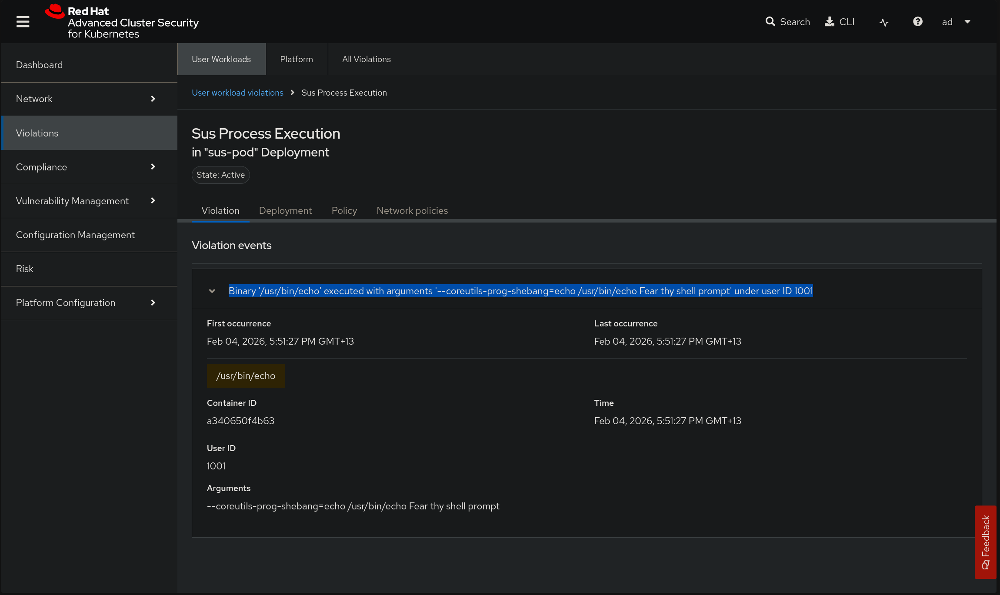

#+TITLE: Auditing pod terminal execution with rhacs
#+DATE: <2026-02-04 Wed>
#+AUTHOR: James Blair

This short write-up will explain how to audit what commands OpenShift platform users with permissions to launch arbitrary processes within existing pods via ~oc exec~ or ~oc rsh~ or the OpenShift Web Console terminal actually execute.

It's pretty easy to disable users from being able to do this via k8s RBAC, or just audit and/or alert when the events occur, this is well explained in the following blog: https://www.redhat.com/en/blog/openshift-logging-and-kubernetes-auditing-the-mighty-duo.

However let's assume you can't disable the ability to do this via RBAC because there is a legit reason why some users **need** the capability, and you really really need to track the exact commands that platform users run including their arguments etc in case they do something naughty.

Unfortunately OpenShift auditing can't go to this level natively currently, however there is a request for enhancement open which is progressing to deliver this functionality in a future release.

The good news is that with the supplementary Red Hat Advanced Cluster Security platform this can be done pretty easily. Below is a proof of concept.

* Pre-requisites

Before attempting any of the commands below I am assuming we have an OpenShift ~4.18~ cluster running, which is being secured by RHACS ~4.9~ (this just happened to be the test environment I had close at hand, these ideas would probably work on other versions I just haven't tested them).

Let's check we're logged in and good to go:

#+NAME: Check oc status
#+begin_src bash
oc version
#+end_src

#+RESULTS: Check oc status
#+begin_example
Client Version: 4.20.12
Kustomize Version: v5.6.0
Server Version: 4.18.32
Kubernetes Version: v1.31.14
#+end_example

* Deploy example workload

We need a dummy pod to tinker with for this example, OpenShift has a basic ~httpd~ pod it will shart onto the cluster if you click **Create Pod** and **Create** in the web console without editing anything. The image should be available on most OpenShift clusters already so we'll use that as our example for convenience:

#+NAME: Deploy example workload
#+begin_src bash
cat << EOF | oc apply --filename -
apiVersion: v1
kind: Namespace
metadata:
  name: sus-ns

---
apiVersion: v1
kind: Pod
metadata:
  name: sus-pod
  namespace: sus-ns
spec:
  containers:
    - name: httpd
      image: image-registry.openshift-image-registry.svc:5000/openshift/httpd:latest
EOF
#+end_src

#+RESULTS: Deploy example workload
#+begin_example
namespace/sus-ns created
pod/sus-pod created
#+end_example

* Creating rhacs policy

So we have our workload, and RHACS is already running in our environment. Now we need to create an ~inform~ policy in RHACS that will tell us about all the things our users are running in their pod terminal sessions so santa knows who's been naughty and nice.

RHACS Has an incredibly powerful out of the box policy called **Unauthorized Process Execution** which does pretty much what we need, let's apply a clone of that policy which is limited specifically to ous ~sus-ns~ namespace just to avoid tinkering with the default policy.

Note:
  - Change the ~metadata.namespace~ in the policy below to wherever your rhacs is installed.
  - Change the ~spec.scope~ to reference a cluster in your environment.

#+NAME: Create rhacs policy
#+begin_src bash
cat << EOF | oc apply --filename -
apiVersion: config.stackrox.io/v1alpha1
kind: SecurityPolicy
metadata:
  name: sus-process-execution
  namespace: stackrox
spec:
  policyName: Sus Process Execution
  description: This policy generates a violation for any process execution that is not explicitly allowed by a locked process baseline for a given container specification within a Kubernetes deployment.
  rationale: A locked process baseline communicates high confidence that execution of a process not included in the baseline positively indicates super sus activity.
  remediation: Evaluate this process execution for sus intent, examine other accessible resources for abnormal activity, then kill the pod in which this process executed.
  categories:
    - Anomalous Activity
  lifecycleStages:
    - RUNTIME
  eventSource: DEPLOYMENT_EVENT
  scope:
    - cluster: bad24ba7-d7c4-47db-a215-88237ffd4340
      namespace: sus-ns
  severity: HIGH_SEVERITY
  policySections:
    - policyGroups:
        - fieldName: Unexpected Process Executed
          booleanOperator: OR
          values:
            - value: "true"
  criteriaLocked: false
  mitreVectorsLocked: false
  isDefault: false
EOF
#+end_src

#+RESULTS: Create rhacs policy
#+begin_example
securitypolicy.config.stackrox.io/sus-process-execution created
#+end_example

* Lock example workload process baseline

The one slightly annoying thing this solution requires is that the process baseline for the workload in question needs to be set to ~locked~.

I don't think this can be set via a k8s native crd yet which is particularly egregious oversight, however it's pretty straightforward to quickly lock either a specific container, or an entire namespace with the RHACS API and RHACS can also be set to automatically lock all process baselines after a predefined observation period. This documentation page is mandatory reading: https://docs.redhat.com/en/documentation/red_hat_advanced_cluster_security_for_kubernetes/4.9/html/operating/evaluate-security-risks#lock-and-unlock-process-baselines_evaluate-security-risks

The below snippet quickly locks the process baselines for all containers in our ~sus-ns~ namespace:

#+NAME: Lock process baseline
#+begin_src bash
source .env

curl --insecure --silent \
    --request PUT \
    --header "Authorization: Bearer ${ROX_API_TOKEN}" \
    --header "Content-Type: application/json" \
    --data '{
      "clusterId": "bad24ba7-d7c4-47db-a215-88237ffd4340",
      "namespaces": [
        "sus-ns"
      ]
    }
}'   "https://${CENTRAL_URL}/v1/processbaselines/bulk/lock"
#+end_src

#+RESULTS: Lock process baseline
#+begin_example
{"success":true}
#+end_example

* Run sus commands in a pod

With the workload of interest deployed, a policy created to alert us when a sus process is launched, and the process baselines locked so we know what isn't normal, let's now carry out some sus activity to demonstrate... 😈

#+NAME: Run sus shell commands in a pod
#+begin_src bash
oc --namespace sus-ns exec sus-pod -- echo "Fear thy shell prompt"
#+end_src

#+RESULTS: Run sus shell commands in a pod
#+begin_example
Fear thy shell prompt
#+end_example

* Review generated violation within rhacs

Here's a screenshot of the generated violation within our RHACS console, we can clearly see the command we ran, including the parameters. Obviously these alerts could be forwarded to a long term siem solution or streamed to a soc for anaylsis.

