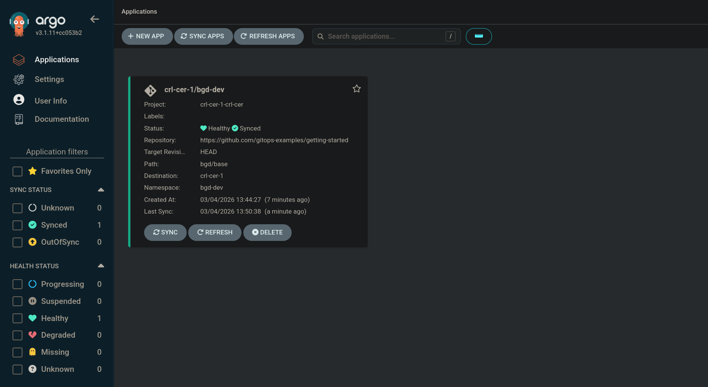

#+TITLE: ArgoCD Agent Autonomous Mode Demo
#+DATE: <2026-03-02 Mon>

A short walkthrough for deplying the new ArgoCD Agent architecture in ~autonomous~ mode with OpenShift GitOps. This demonstration is adapted from the original [[https://developers.redhat.com/blog/2025/10/06/using-argo-cd-agent-openshift-gitops][blog]] which was based on the ~managed~ mode. For more context and background information on the ArgodCD Agent architecture please refer to the linked blog.

* Pre-requisites

- [ ] Two OpenShift Clusters, these instructions have been tested with OpenShift ~4.21~. The instructions assume that you have not installed the OpenShift GitOps operator as it will install the operator with a ~Subscription~ using specific configuration. If you already have the OpenShift GitOps Operator installed, review this aspect of the walkthrough carefully and adjust as neccessary for your environment.

- [ ] Access to those two clusters with cluster-admin privileges. This guide assumes you have two named ~oc~ contexts available, ~principal~ (hub) and ~crl-cer-1~ (autonomous agent).

- [ ] The ~oc~ command line tool available in your path.

- [ ] The ~argocd-agentctl~ command line tool available in your path. This tool is used to manage the PKI requirements for the Agent. Download this from https://github.com/argoproj-labs/argocd-agent/releases/tag/v0.7.0.

- [ ] The ~envsubst~ command available on your path, this is typically already available on many distributions.

* Setup principal

The first part of this process is to set up our hub cluster as the **principal** that our agents will talk to.

** Install openshift gitops

Assuming this repository is cloned we can begin by installing OpenShift GitOps on the hub cluster as follows:

#+begin_src bash
oc --context principal apply --filename 1-principal/operator-namespace.yaml
oc --context principal apply --filename 1-principal/operator-subscription.yaml
oc --context principal apply --filename 1-principal/operator-group.yaml
#+end_src

#+RESULTS:
#+begin_example
namespace/openshift-gitops-operator created
subscription.operators.coreos.com/openshift-gitops-operator created
operatorgroup.operators.coreos.com/openshift-gitops-operator created
#+end_example

We can review the pods in the ~openshift-gitops-operator~ namespace to confirm the operator has installed and is running:

#+begin_src bash
oc --context principal get pods --namespace openshift-gitops-operator
#+end_src

#+RESULTS:
#+begin_example
NAME                                                            READY   STATUS    RESTARTS   AGE
openshift-gitops-operator-controller-manager-844869476c-5t77m   2/2     Running   0          21s
#+end_example

** Create required namespaces

Once OpenShift GitOps is ready let's create the namespaces we'll be using. It's pretty straightforward here, we just need a namespace for our principal cluster, and a namespace for each agent cluster.

#+begin_quote
Note: We're intentionally using seperate namespaces to the standard ~openshift-gitops~ namespace in case we are already running a gitops stack on our hub cluster and wanting to leave that in place while we take the agent architecture for a spin.
#+end_quote

#+begin_src bash
oc --context principal apply --filename 1-principal/principal-namespace.yaml
oc --context principal apply --filename 1-principal/agent-namespace.yaml
#+end_src

#+RESULTS:
#+begin_example
namespace/argocd created
namespace/crl-cer-1 created
#+end_example

** Create pki on principal

The Argo CD Agent requires certificates to be provisioned on both the **Principal** and **Agent** clusters. These certificates are used to manage authorization and trust between the clusters.

#+begin_quote
Note: Alternatively Red Hat Advanced Cluster Management provides an add-on that will manage this for you automatically. For this walkthrough we will use ~argocd-agentctl~ to do this to avoid interacting with a potentially pre-existing RHACM gitops configuration.
#+end_quote

#+begin_src bash
argocd-agentctl pki init \
    --principal-context principal \
    --principal-namespace argocd
#+end_src

#+RESULTS:
#+begin_example
Generating CA and storing it in secret
Success. CA data stored in secret argocd/argocd-agent-ca
#+end_example

Next we issue a certificate that will be used to expose the Principal outside of the cluster. In this demo we will be using an OpenShift Route to expose the Principal but you could alternatively use some a load balancer or alternative network solution instead.

#+begin_src bash
export SUBDOMAIN=$(oc --context principal get dns cluster --output jsonpath='{.spec.baseDomain}')

argocd-agentctl pki issue principal \
    --dns argocd-agent-principal-argocd.apps.${SUBDOMAIN} \
    --principal-context principal \
    --principal-namespace argocd
#+end_src

#+RESULTS:
#+begin_example
Secret argocd/argocd-agent-principal-tls created
#+end_example

Now we need to provision the certificate for the Principals ~resource-proxy~, this is to enable the Argo CD Agent to communicate with the Principal to sync resources.

#+begin_src bash
argocd-agentctl pki issue resource-proxy \
    --dns argocd-agent-resource-proxy.argocd.svc.cluster.local \
    --principal-context principal \
    --principal-namespace argocd
#+end_src

#+RESULTS:
#+begin_example
Secret argocd/argocd-agent-resource-proxy-tls created
#+end_example

Lastly we need to generate the JWT signing key as follows:

#+begin_src bash
argocd-agentctl jwt create-key \
    --principal-context principal \
    --upsert
#+end_src

#+RESULTS:
#+begin_example
Generating JWT signing key...
Success. JWT signing key created and stored in secret argocd/argocd-agent-jwt
#+end_example

** Deploy argocd principal

With the operator, namespaces & pki in place we can now deploy the argocd principal components.

#+begin_src bash
oc --context principal apply --filename 1-principal/argocd.yaml
oc --context principal apply --filename 1-principal/route.yaml
oc --context principal apply --filename 1-principal/proxy-service.yaml
#+end_src

#+RESULTS:
#+begin_example
argocd.argoproj.io/argocd created
route.route.openshift.io/argocd-agent-principal created
service/argocd-agent-resource-proxy created
#+end_example

We can check that the principal has started by reviewing the application pods.

#+begin_quote
Note: It's normal for the ~argocd-agent-principal~ pod to be in a ~CrashLoopBackOff~ state at this stage. This will heal later once the remaining configuration is completed.
#+end_quote

#+begin_src bash
oc --context principal get pods --namespace argocd
#+end_src

#+RESULTS:
#+begin_example
NAME                                      READY   STATUS             RESTARTS      AGE
argocd-agent-principal-544f769545-bllbz   0/1     CrashLoopBackOff   5 (63s ago)   4m23s
argocd-dex-server-5847947656-rmjnm        1/1     Running            0             4m23s
argocd-redis-5dc66c9bc8-9bgrd             1/1     Running            0             4m24s
argocd-repo-server-7f9d4f867-f9b2w        1/1     Running            0             4m24s
argocd-server-74dc7688f6-vjmwm            1/1     Running            0             4m24s
#+end_example

** Create missing redis secret

The argo agent principal currently looks for a specifically named secret ~argocd-redis~ secret when it launches. The redis secret is created with a different name by the OpenShift GitOps operator currently so we need to create the secret with the correct name manually.

#+begin_src bash
export REDIS_PASSWORD="$(oc --context principal get secret argocd-redis-initial-password --namespace argocd --output jsonpath='{.data.admin\.password}' | base64 --decode)"

oc --context principal create secret generic argocd-redis \
    --namespace argocd \
    --from-literal=auth="${REDIS_PASSWORD}"
#+end_src

#+RESULTS:
#+begin_example
secret/argocd-redis created
#+end_example

** Configure principal for agent

Lastly, we can inform the principal about our soon to be coming online agent cluster.

#+begin_src bash
argocd-agentctl agent create crl-cer-1 \
  --principal-context principal \
  --principal-namespace argocd \
  --resource-proxy-server argocd-agent-resource-proxy.argocd.svc.cluster.local:9090
#+end_src

* Installing the agent

** Install openshift gitops

With the principal in place let's now deploy our agent, starting with the operator.

#+begin_quote
Note: In the subscription for the agent we set ~DISABLE_DEFAULT_ARGOCD_INSTANCE~ true so that we don't deploy the default full "openshift-gitops" instance. Update this if your cluster does rely on having this available.
#+end_quote

#+begin_src bash
oc --context crl-cer-1 apply --filename 2-agent/operator-namespace.yaml
oc --context crl-cer-1 apply --filename 2-agent/operator-subscription.yaml
oc --context crl-cer-1 apply --filename 2-agent/operator-group.yaml
#+end_src

#+RESULTS:
#+begin_example
namespace/openshift-gitops-operator created
subscription.operators.coreos.com/openshift-gitops-operator created
operatorgroup.operators.coreos.com/openshift-gitops-operator created
#+end_example

Once the operator is installed we can create the ~argocd~ resource representing our agent. Notice how ~service.enabled~ is set to ~false~.

#+begin_src bash
oc --context crl-cer-1 apply --filename 2-agent/argocd-namespace.yaml
oc --context crl-cer-1 apply --filename 2-agent/argocd-appproject.yaml
oc --context crl-cer-1 apply --filename 2-agent/argocd.yaml
#+end_src

#+RESULTS:
#+begin_example
namespace/argocd created
appproject.argoproj.io/crl-cer created
argocd.argoproj.io/argocd created
#+end_example

** Create missing redis secret

As we did on the principal we need to create the correctly named redis secret.

#+begin_src bash
export REDIS_PASSWORD="$(oc --context crl-cer-1 get secret argocd-redis-initial-password --namespace argocd --output jsonpath='{.data.admin\.password}' | base64 --decode)"

oc --context crl-cer-1 create secret generic argocd-redis \
    --namespace argocd \
    --from-literal=auth="${REDIS_PASSWORD}"
#+end_src

#+RESULTS:
#+begin_example
secret/argocd-redis created
#+end_example

** Create pki on agent

Now we create the corresponding pki assets on the agent side to ensure secure mTLS communication between the agent and the principal.

In this step we also propagate the CA certificate stored in the ~argocd-agent-ca~ secret on the Principal to the Agent.

#+begin_src bash
argocd-agentctl pki issue agent crl-cer-1 \
    --principal-context principal \
    --principal-namespace argocd \
    --agent-context crl-cer-1 \
    --agent-namespace argocd

argocd-agentctl pki propagate crl-cer-1 \
    --principal-context principal \
    --principal-namespace argocd \
    --agent-context crl-cer-1 \
    --agent-namespace argocd
#+end_src

** Deploy argocd agent

With everything in place we can now spin up the agent.

#+begin_quote
Note: The manifest for the agent was assembled from https://github.com/argoproj-labs/argocd-agent/tree/main/install/kubernetes/agent.
#+end_quote

#+begin_src bash
oc --context crl-cer-1 apply --filename 2-agent/agent.yaml
#+end_src

#+RESULTS:
#+begin_example
serviceaccount/argocd-agent-agent created
role.rbac.authorization.k8s.io/argocd-agent-agent created
clusterrole.rbac.authorization.k8s.io/argocd-agent-agent unchanged
rolebinding.rbac.authorization.k8s.io/argocd-agent-agent created
clusterrolebinding.rbac.authorization.k8s.io/agent-application-controller-cluster-admin unchanged
clusterrolebinding.rbac.authorization.k8s.io/argocd-agent-agent unchanged
configmap/argocd-agent-params unchanged
service/argocd-agent-agent-healthz created
service/argocd-agent-agent-metrics created
deployment.apps/argocd-agent-agent created
#+end_example

* Deploying a sample application

With the principal in place, and the agent running. Let's create an application on our agent cluster.  The agent will observe this and begin deploying it for us!

#+begin_src bash
oc --context crl-cer-1 apply --filename 3-application/application.yaml
#+end_src

#+RESULTS:
#+begin_example
application.argoproj.io/bgd-dev created
#+end_example

After creating the application we can log in to the instance of ArgoCD running in the ~argocd~ namespace on the principal / hub cluster. Use the admin password from the automatically generated secret for this.

Within this principal instance we should now see our application syncing, even though the actual reconcilliation has all occurred and will continue to occur on our autonomous agent 🎉

