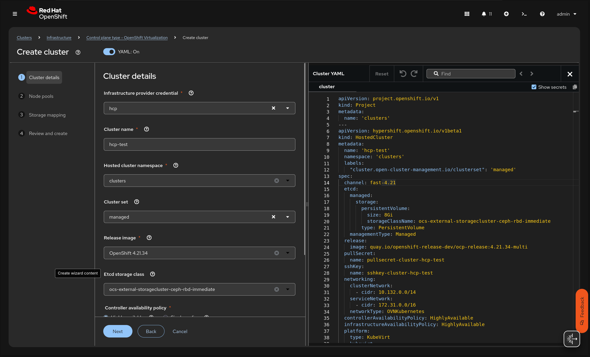

#+TITLE: Declarative hosted cluster provisioning
#+AUTHOR: James Blair
#+DATE: <2026-09-28 Mon>

Below is a redacted example of the complete manifests required to provision a new Hosted Control Plane cluster ~hcp-test~ on OpenShift, with a worker node pool leveraging OpenShift Virtualization.

These sample manifests can be easily dynamically generated with a guided form in Red Hat Advanced Cluster Management. Below is an example screenshot mid flow:

#+NAME: Manifests
#+begin_src yaml
---
apiVersion: project.openshift.io/v1
kind: Project
metadata:
  name: 'clusters'

---
apiVersion: hypershift.openshift.io/v1beta1
kind: HostedCluster
metadata:
  name: 'hcp-test'
  namespace: 'clusters'
  labels:
    "cluster.open-cluster-management.io/clusterset": 'managed'
spec:
  channel: fast-4.21
  etcd:
    managed:
      storage:
        persistentVolume:
          size: 8Gi
          storageClassName: ocs-external-storagecluster-ceph-rbd-immediate
        type: PersistentVolume
    managementType: Managed
  release:
    image: quay.io/openshift-release-dev/ocp-release:4.21.34-multi
  pullSecret:
    name: pullsecret-cluster-hcp-test
  sshKey:
    name: sshkey-cluster-hcp-test
  networking:
    clusterNetwork:
      - cidr: 10.132.0.0/14
    serviceNetwork:
      - cidr: 172.31.0.0/16
    networkType: OVNKubernetes
  controllerAvailabilityPolicy: HighlyAvailable
  infrastructureAvailabilityPolicy: HighlyAvailable
  platform:
    type: KubeVirt
    kubevirt:
      baseDomainPassthrough: true
  infraID: 'hcp-test'
  services:
    - service: OAuthServer
      servicePublishingStrategy:
        type: Route
    - service: OIDC
      servicePublishingStrategy:
        type: Route
    - service: Konnectivity
      servicePublishingStrategy:
        type: Route
    - service: Ignition
      servicePublishingStrategy:
        type: Route

---
apiVersion: v1
kind: Secret
metadata:
  name: pullsecret-cluster-hcp-test
  namespace: 'clusters'
stringData:
  '.dockerconfigjson': |-
    {"auths":{"cloud.openshift.com":{"auth":"<redacted>
type: kubernetes.io/dockerconfigjson

---
apiVersion: v1
kind: Secret
metadata:
  name: sshkey-cluster-hcp-test
  namespace: 'clusters'
stringData:
  'id_rsa.pub': <redacted>

---
apiVersion: hypershift.openshift.io/v1beta1
kind: NodePool
metadata:
  name: 'hcp-test'
  namespace: 'clusters'
spec:
  arch: amd64
  clusterName: 'hcp-test'
  replicas: 3
  management:
    autoRepair: false
    upgradeType: Replace
  platform:
    type: KubeVirt
    kubevirt:
      compute:
        cores: 8
        memory: 64Gi
      rootVolume:
        type: Persistent
        persistent:
          size: 32Gi
      attachDefaultNetwork: true
  release:
    image: quay.io/openshift-release-dev/ocp-release:4.21.34-multi

---
apiVersion: cluster.open-cluster-management.io/v1
kind: ManagedCluster
metadata:
  annotations:
    import.open-cluster-management.io/hosting-cluster-name: local-cluster 
    import.open-cluster-management.io/klusterlet-deploy-mode: Hosted
    open-cluster-management/created-via: hypershift
  labels:
    cloud: BareMetal
    vendor: OpenShift
    name: 'hcp-test'
    cluster.open-cluster-management.io/clusterset: 'managed'
  name: 'hcp-test'
spec:
  hubAcceptsClient: true

---
apiVersion: agent.open-cluster-management.io/v1
kind: KlusterletAddonConfig
metadata:
  name: 'hcp-test'
  namespace: 'hcp-test'
spec:
  clusterName: 'hcp-test'
  clusterNamespace: 'hcp-test'
  clusterLabels:
    cloud: BareMetal
    vendor: OpenShift
  applicationManager:
    enabled: true
  policyController:
    enabled: true
  searchCollector:
    enabled: true
  certPolicyController:
    enabled: true

#+end_src
